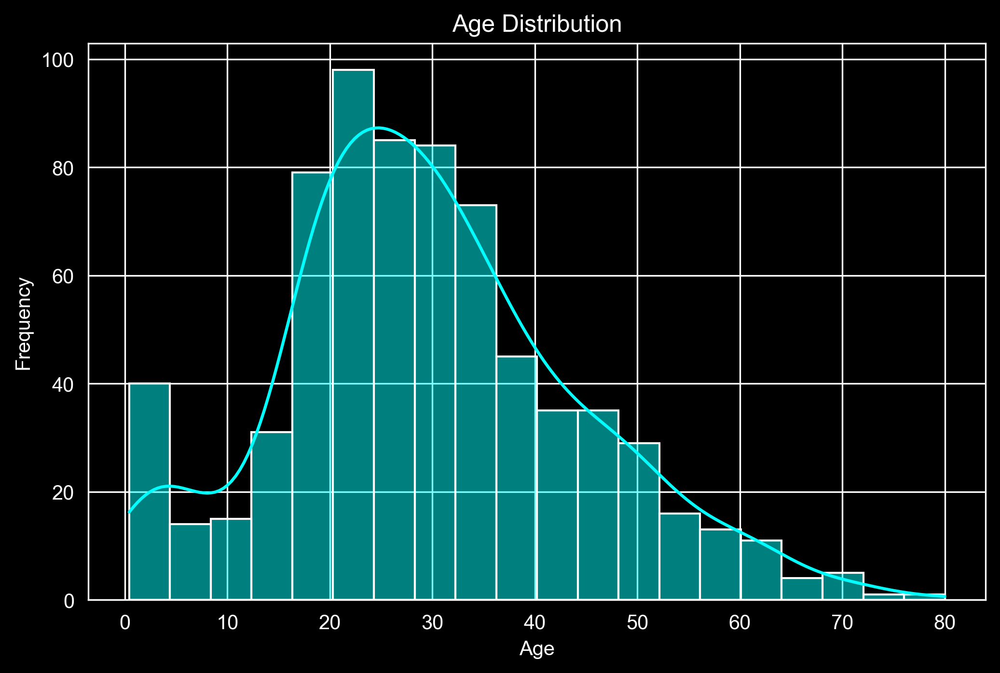
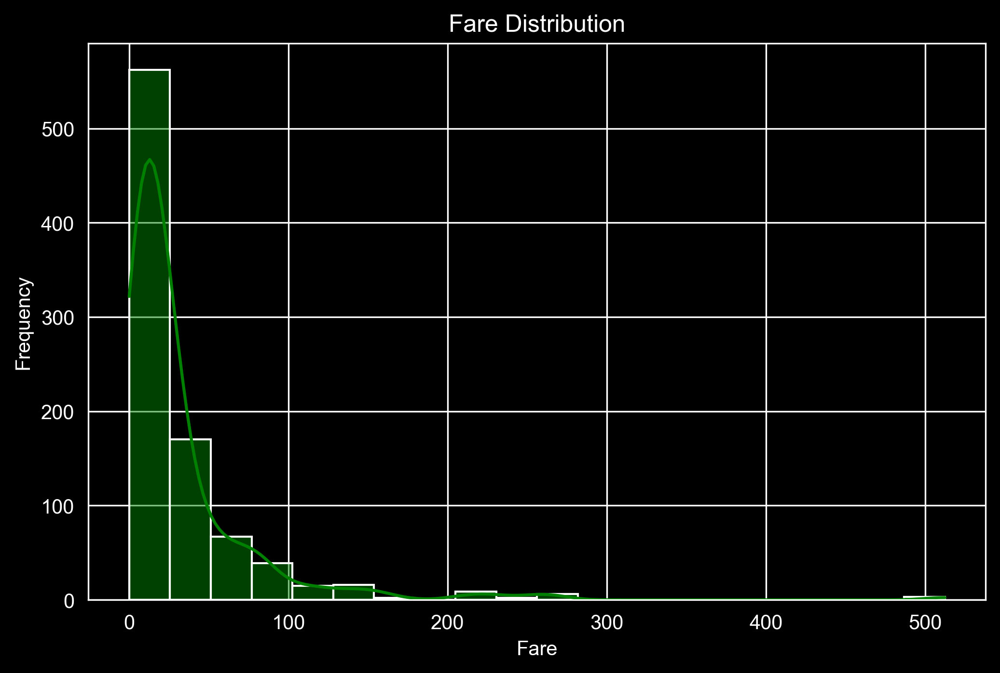
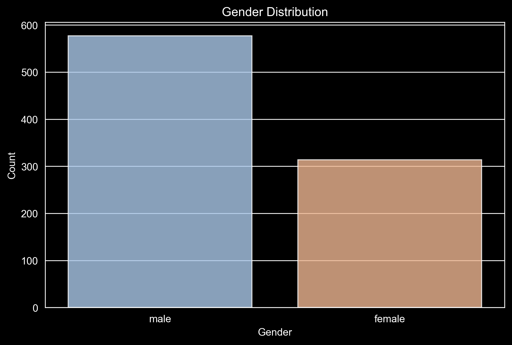
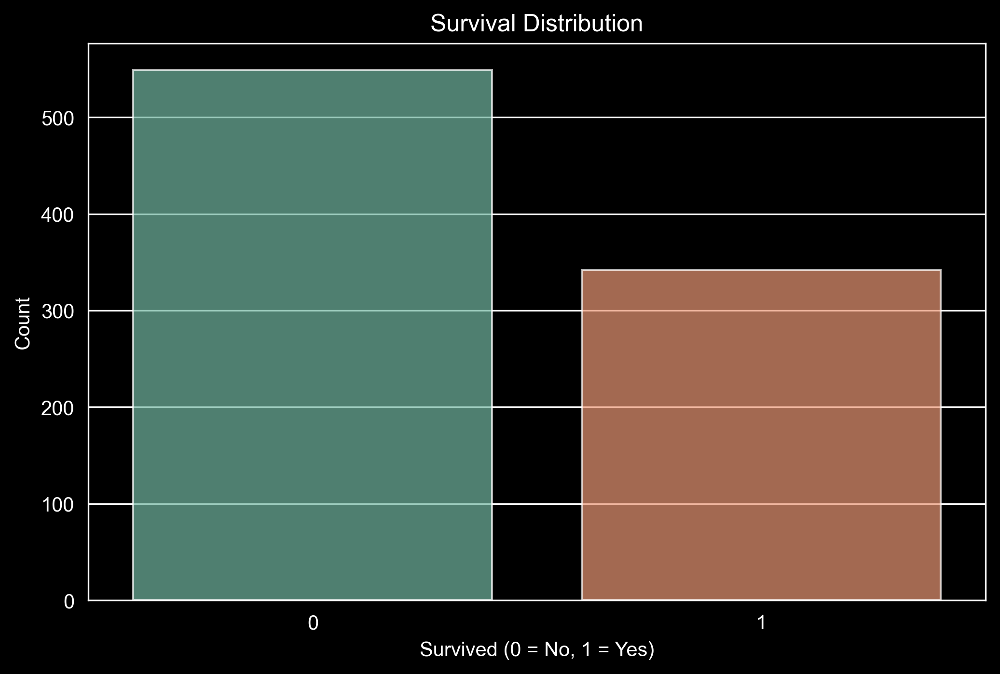
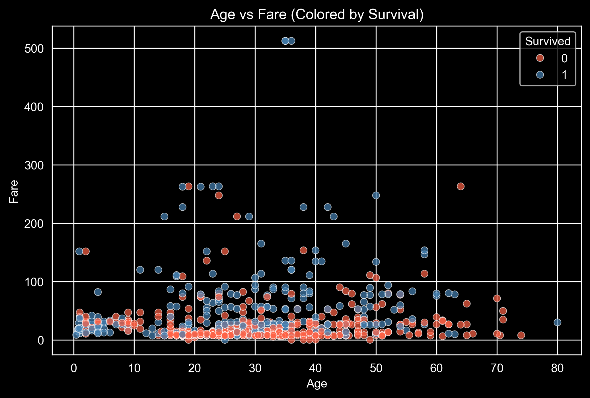

# Data Analysis Project: Titanic Dataset

## Overview
This project involves a comprehensive analysis of the Titanic dataset to uncover insights about passenger demographics, survival rates, and fare distributions. The analysis includes exploratory data analysis (EDA), hypothesis testing, and regression modeling to answer critical questions and highlight significant patterns.

## Installation & Setup
To run this project locally, follow the steps below:

### 1. Clone the Repository
Clone the repository to your local machine:
```bash
git clone https://github.com/MoustafaMohamed01/Data-Analysis-of-Titanic-Dataset.git
cd Data-Analysis-of-Titanic-Dataset
```

### 2. Install Dependencies
Navigate to the project directory and install the required Python libraries using `pip`:
```bash
pip install -r requirements.txt
```

install the dependencies manually:
```bash
pip install numpy pandas matplotlib seaborn scipy statsmodels scikit-learn
```

### 3. Run the Jupyter Notebook or Python Script
You can open the Jupyter notebook (if provided) or run the Python script:
```bash
jupyter notebook
```
Or, to run the Python script directly:
```bash
python Titanic_Dataset_Analysis.py
```

## Features
1. **Descriptive Statistics**
   - Calculated mean, median, mode, variance, and standard deviation for key variables like age and fare.

2. **Data Visualization**
   - **Age Distribution:** Histogram showcasing passenger age distribution.
     
   - **Fare Distribution:** Histogram illustrating fare variability.
     
   - **Sex Distribution:** Bar chart comparing the count of male and female passengers.
     
   - **Survival Distribution:** Bar chart analyzing survival rates.
     
   - **Age vs. Fare:** Scatter plot to visualize the relationship between passenger age and fare.
     

3. **Hypothesis Testing**
   - Test of Difference Between Proportions.
   - Independent Two-Samples T-Test.
   - Chi-Square Independence Test.
   - Mann-Whitney U Test.
   - ANOVA (Analysis of Variance).

4. **Regression Analysis**
   - Linear Regression.
   - Logistic Regression.
   - Multiple Regression (with interaction terms).
   - Polynomial Regression.
   - Ridge Regression.
   - Lasso Regression.

## Dataset
- **Source:** Titanic dataset (uploaded).
- **Description:**
  - Passenger information including demographic details, ticket class, survival status, and fares.
  - Contains variables such as `PassengerId`, `Survived`, `Pclass`, `Name`, `Sex`, `Age`, `SibSp`, `Parch`, `Ticket`, `Fare`, `Cabin`, and `Embarked`.

Dataset Source: [Kaggle - Titanic Dataset](https://www.kaggle.com/datasets/yasserh/titanic-dataset).


## Results
1. **Key Insights:**
   - Survival rates varied significantly by sex and passenger class.
   - Younger passengers tended to have lower fares, as highlighted in scatter plots.
2. **Hypothesis Testing Outcomes:**
   - Significant differences were observed in survival rates based on gender (Chi-Square Test).
   - ANOVA revealed variance in fares across different passenger classes.
3. **Regression Analysis:**
   - Logistic regression effectively modeled survival probabilities.
   - Ridge and Lasso regressions provided regularized solutions for predicting fares.

## Contributing
Contributions are welcome! Please fork the repository, make your changes, and create a pull request.

---

**Follow me on**: [LinkedIn](https://www.linkedin.com/in/moustafa-mohamed-047736296/) | [GitHub](https://github.com/MoustafaMohamed01) | [Kaggle](https://www.kaggle.com/moustafamohamed01)
